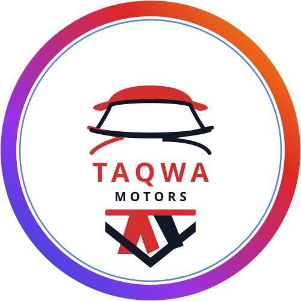

# Taqwa Motors — Premium Car Dealership Website

> **“Where Trust Drives Everything”**

A modern, trustworthy, and high-converting car dealership website for **Taqwa Motors**, located in Rawalpindi, Pakistan.



---

## 🌟 Key Features

- **Brand Identity**: Built around the official Taqwa Motors logo with signature Crimson Red, Royal Navy Blue, and multi-hue gradient accents.
- **Cinematic Hero Video**: Full-width responsive automotive background video with a subtle luxury dark overlay for crystal-clear readability.
- **Hero Quick Search Bar**: Instant jump to filtered inventory by make, body type, and budget.
- **Pakistani Certified Inventory Hub**: Multi-attribute filtering (Make, Body Type, Price Range Slider in PKR Lacs/Crores, Model Year, Fuel, Transmission, Registration City).
- **Vehicle Details Modal**: High-res multi-angle photo gallery, condition inspection scorecards, comprehensive technical specifications, and safety/comfort feature lists.
- **WhatsApp Direct Lead Generation (`0333-5406173`)**: Contextual pre-filled messages on every car card, details modal, and contact form.
- **Interactive Car Financing & EMI Loan Calculator**: Real-time monthly installment estimates with one-click export to WhatsApp.
- **Side-by-Side Comparison Tool**: Compare up to 3 vehicles simultaneously.
- **Floating WhatsApp Sales Desk**: Multi-agent chat drawer for quick consultations, test drive bookings, and showroom location maps.
- **SEO & Schema.org**: Fully localized for Rawalpindi/Islamabad with `AutoDealer` JSON-LD structured data.

---

## 📍 Business & Showroom Information

- **Business Name**: Taqwa Motors
- **Category**: Car Dealership / Used & Imported Japanese Cars
- **Showroom Address**: H2X7+VP4 Range Road, Chowk, Shalley Valley, Rawalpindi, 46000, Pakistan
- **Phone / WhatsApp**: 0333-5406173
- **Business Hours**: 8:00 AM – 10:00 PM (Open 7 Days a Week)

---

## 🚀 Deployment Options

### Option 1: GitHub Pages (Instant Free Hosting)
1. Go to your repository **Settings** on GitHub: `https://github.com/alighalib461/taqwa-motors/settings/pages`
2. Under **Build and deployment > Source**, select `Deploy from a branch`.
3. Choose the `main` branch and `/ (root)` folder, then click **Save**.
4. Your website will be live in 1-2 minutes at:
   `https://alighalib461.github.io/taqwa-motors/`

### Option 2: Vercel / Netlify
1. Import `https://github.com/alighalib461/taqwa-motors` into Vercel or Netlify.
2. No build command or configuration required — deploy directly as a static site.

---

## 💻 Local Development

Run with any local web server:
```powershell
python -m http.server 8080
```
Then open `http://localhost:8080/index.html` in your browser.

---

© 2026 Taqwa Motors. All Rights Reserved. Rawalpindi, Pakistan.
